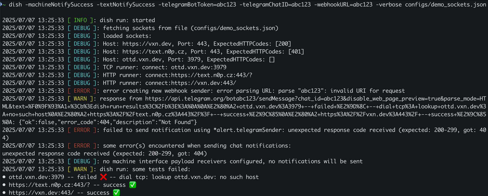

<h1 align="left">

dish
</h1>

[](https://pkg.go.dev/go.vxn.dev/dish)
[](https://goreportcard.com/report/go.vxn.dev/dish)
[](https://libs.tech/project/468033120/dish)

+ __Tiny__ one-shot monitoring service
+ __Remote__ configuration of independent 'dish network' (via loading the socket list to be checked from a remote API)
+ __Fast__ concurrent testing, low overall execution time, 10-sec timeout per socket by default
+ __0__ dependencies

## Use Cases

+ Lightweight health checks of HTTP and/or TCP sockets
+ Decentralized monitoring with standalone dish instances deployed on different hosts that pull configuration from a common API
+ Cron-driven one-shot checks without the need for any long-running agents

## Install

```shell
go install go.vxn.dev/dish/cmd/dish@latest
```

## Usage

```
dish [FLAGS] SOURCE
```


### Source

The list of sockets to be checked can be provided via a local JSON file (e.g. the `./configs/demo_sockets.json` file included in this repository as an example), or via a remote RESTful JSON API.

For the expected JSON schema of the list of sockets to be checked, see `./configs/demo_sockets.json`.

```bash
# local JSON file
dish /opt/dish/sockets.json

# remote JSON API source
dish http://restapi.example.com/dish/sockets/:instance
```

### Flags

```
dish -h
Usage of dish:
  -hname string
        a string, custom additional header name
  -hvalue string
        a string, custom additional header value
  -machineNotifySuccess
        a bool, specifies whether successful checks with no failures should be reported to machine channels
  -name string
        a string, dish instance name (default "generic-dish")
  -target string
        a string, result update path/URL to pushgateway, plaintext/byte output
  -telegramBotToken string
        a string, Telegram bot private token
  -telegramChatID string
        a string, Telegram chat/channel ID
  -textNotifySuccess
        a bool, specifies whether successful checks with no failures should be reported to text channels
  -timeout uint
        an int, timeout in seconds for http and tcp calls (default 10)
  -updateURL string
        a string, API endpoint URL for pushing results
  -verbose
        a bool, console stdout logging toggle
  -webhookURL string
        a string, URL of webhook endpoint
```

### Alerting

When a socket test fails, it's always good to be notified. For this purpose, dish provides 4 different ways of doing so (can be combined):

+ Test results upload to a remote JSON API (using the `-updateURL` flag)
+ Check results as the Telegram message body (via the `-telegramBotToken` and `-telegramChatID` flags)
+ Failed count and last test timestamp update to Pushgateway for Prometheus (using the `-target` flag)
+ Test results push to a webhook URL (using the `-webhookURL` flag)

Whether successful runs with no failed checks should be reported can also be configured using flags:

+ `-textNotifySuccess` for text channels (e.g. Telegram)
+ `-machineNotifySuccess` for machine channels (e.g. webhooks, remote API or Pushgateway)


(The screenshot above shows Telegram alerting as of `v1.10.0`. The screenshot shows the result of using the `-textNotifySuccess` flag to include successful checks in the alert as well.)

### Examples

One way to run dish is to build and install a binary executable.

```shell
# Fetch and install the specific version
go install go.vxn.dev/dish/cmd/dish@latest

export PATH=$PATH:~/go/bin

# Load sockets from sockets.json file, and use Telegram 
# provider for alerting
dish -telegramChatID "-123456789" \
 -telegramBotToken "123:AAAbcD_ef" \
 sockets.json

# Use remote JSON API service as socket source, and push
# the results to Pushgateway
dish -target https://pushgw.example.com/ \
 https://api.example.com/dish/sockets
```

#### Using Docker

```shell
# Copy, and/or edit dot-env file (optional)
cp .env.example .env
vi .env

# Build a Docker image
make build

# Run using docker compose stack
make run

# Run using native docker run
docker run --rm \
 dish:1.10.1-go1.24 \
 -verbose \
 -target https://pushgateway.example.com \
 https://api.example.com
```

#### Bash script and cronjob

Create a bash script to easily deploy dish and update its settings:

```shell
vi tiny-dish-run.sh
```

```shell
#!/bin/bash

TELEGRAM_TOKEN="123:AAAbcD_ef"
TELEGRAM_CHATID="-123456789"

SOURCE_URL=https://api.example.com/dish/sockets
UPDATE_URL=https://api.example.com/dish/sockets/results
TARGET_URL=https://pushgw.example.com

DISH_TAG=dish:1.10.1-go1.24
INSTANCE_NAME=tiny-dish

API_TOKEN=AbCd

docker run --rm \
        ${DISH_TAG} \
        -name ${INSTANCE_NAME} \
        -hvalue ${API_TOKEN} \
        -hname X-Auth-Token \
        -target ${TARGET_URL} \
        -updateURL ${UPDATE_URL} \
        -telegramBotToken ${TELEGRAM_TOKEN} \
        -telegramChatID ${TELEGRAM_CHATID} \
        -timeout 15 \
        -verbose \
        ${SOURCE_URL}
```

Make it an executable:

```shell
chmod +x tiny-dish-run.sh
```

##### Cronjob to run periodically

```shell
crontab -e
```

```shell
# m h  dom mon dow   command
MAILTO=monitoring@example.com

*/2 * * * * /home/user/tiny-dish-run.sh
```

## History

[dish history article](https://krusty.space/projects/dish/)
